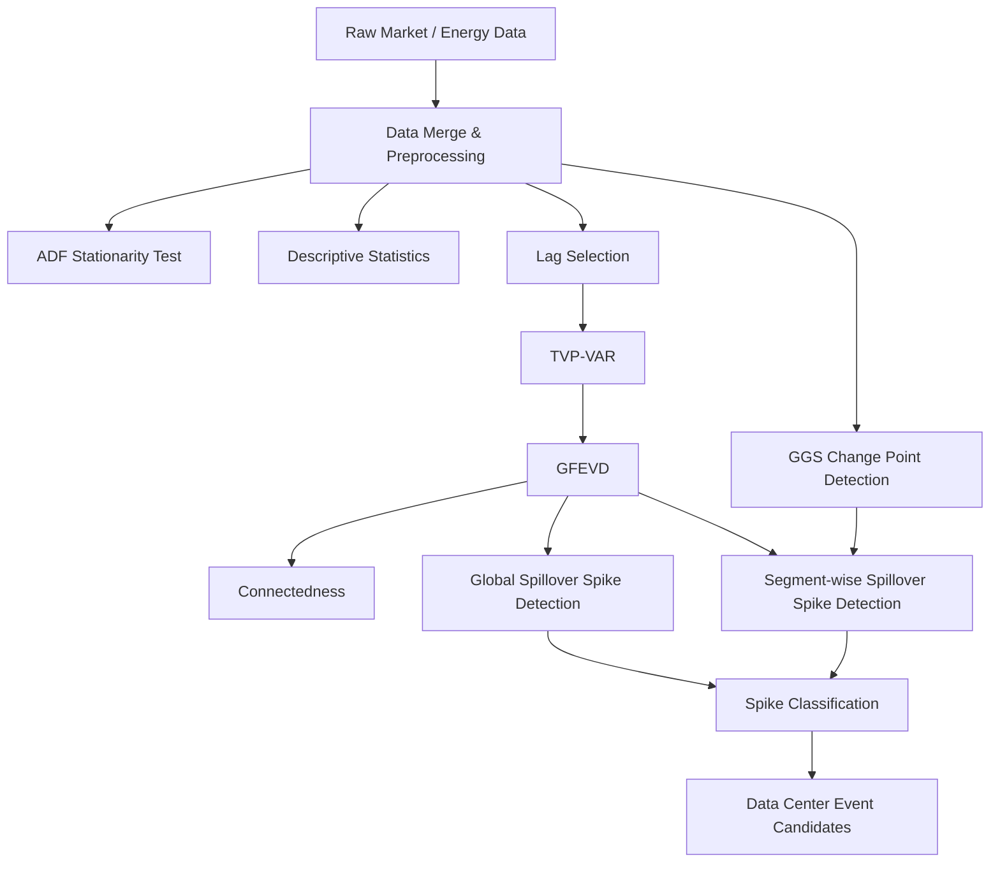

# DC and Materials 2

데이터센터 관련 주가 지수인 **SOLVPN**과 원자재·에너지·금융시장 변수 사이의 **시간가변적 spillover 및 connectedness 구조**를 분석하는 연구용 파이프라인입니다.

본 프로젝트의 핵심 목적은 미래 가격을 예측하는 것이 아니라, 특정 변수에 발생한 충격이 다른 변수로 어떻게 전달되는지와 각 변수가 충격을 얼마나 **보내고(To)**, **받는지(From)** 를 정량화하는 것입니다.

---

## 1. 프로그램의 목적 및 개요

### 1.1 연구 목적

본 프로젝트는 다음 질문을 분석합니다.

- 데이터센터 관련 시장 변화가 원자재·에너지·금융시장과 어떤 동적 관계를 가지는가?
- 변수 간 shock transmission은 시간에 따라 어떻게 변화하는가?
- 어떤 변수가 spillover의 순수 전달자(Net Transmitter) 또는 순수 수신자(Net Receiver) 역할을 하는가?
- 전체 기간에서 크게 관찰되는 spillover와 특정 market regime 내부에서만 상대적으로 크게 나타나는 spillover는 어떻게 다른가?
- 데이터센터 관련 spillover event가 특정 covariance regime에서 조건부로 강화되는가?

즉, 본 프로그램은 **예측 모델링**보다 **영향 분석, 충격 전이, 구조 변화 탐지**에 초점을 둡니다.

### 1.2 분석 대상 변수

| 변수 | 설명 |
|---|---|
| `SOLVPN` | 데이터센터 관련 주가 지수 |
| `COPPER` | 구리 가격 |
| `GOLD` | 금 가격 |
| `SILVER` | 은 가격 |
| `DXY` | 달러 인덱스 |
| `UST10Y` | 미국 10년물 국채 수익률 |
| `VIX` | CBOE VIX 변동성 지수 |
| `OIL` | 원유 가격 |
| `GAS` | 천연가스 가격 |
| `PJM_LMP` | PJM Interconnection 전력시장의 위치 기반 전력가격 |

분석에 사용되는 최종 공통 기간은 다음과 같습니다.

```text
2022-12-01 ~ 2026-01-06
```

### 1.3 전체 분석 파이프라인



분석 단계는 크게 두 부분으로 구성됩니다.

**Part 1. Connectedness 산출**

1. 데이터 구성 및 전처리
2. ADF stationarity test
3. Descriptive statistics
4. Lag selection
5. TVP-VAR estimation
6. GFEVD
7. Connectedness

**Part 2. Data Center Event 분석**

8. GGS 기반 regime / change-point 탐지
9. Global 및 segment-wise spillover spike detection
10. Spike classification
11. Data Center event candidate 구성

---

## 2. 프로그램 파일들과 산출물 구조

저장소의 주요 구조는 다음과 같습니다.

```text
DC_and_meterials_2/
│
├── 01_REF/
│   └── *.pdf
│
├── 02_Data_EDA/
│   ├── data_log.ipynb
│   ├── data_visualization.ipynb
│   ├── original_data/
│   └── tvpvar_preprocessed/
│       ├── tvpvar_raw_level_merged.csv
│       ├── tvpvar_input_transformed.csv
│       └── tvpvar_input_scaled.csv
│
├── 03_ADF_test/
│   ├── adf.ipynb
│   └── result/
│       ├── adf_raw.csv
│       ├── adf_transformed.csv
│       └── adf_summary.txt
│
├── 04_statistics/
│   ├── statistics.ipynb
│   └── descriptive_stats.csv
│
├── 05_LAG/
│   ├── lag.ipynb
│   ├── tvp_var.ipynb
│   └── result/
│       ├── lag_selection_table.csv
│       ├── lag_selection_summary.txt
│       ├── tvpvar_beta.npy
│       ├── tvpvar_cov.npy
│       ├── tvpvar_selected_lag.txt
│       ├── tvpvar_effective_dates.csv
│       ├── tvpvar_var_names.csv
│       └── tvpvar_diag_summary.csv
│
├── 06_GFEVD/
│   ├── GFEVD.ipynb
│   ├── check_gfevd.ipynb
│   └── result/
│       ├── gfevd_all.npy
│       ├── gfevd_last.csv
│       ├── gfevd_mean.csv
│       ├── gfevd_diag_summary.csv
│       ├── gfevd_tci_timeseries.csv
│       ├── gfevd_directional_to.csv
│       ├── gfevd_directional_from.csv
│       ├── gfevd_net.csv
│       └── gfevd_pairwise_net.csv
│
├── 07_Connectedness/
│   ├── connectedness.ipynb
│   └── connectedness_output/
│       ├── connectedness_mean.csv
│       ├── connectedness_table_mean.csv
│       ├── connectedness_time.csv
│       ├── net_direction.csv
│       ├── pairwise_net_mean.csv
│       ├── pairwise_net_time_wide.csv
│       └── solvpn_to_all_spillover.csv
│
├── 08_GGS/
│   ├── full_GGS.ipynb
│   ├── pair_GGS.ipynb
│   ├── result_full_robust/
│   │   ├── full_ggs_change_points_by_minsize.csv
│   │   ├── full_ggs_grid_search_bic_by_minsize.csv
│   │   ├── full_ggs_robust_change_point_clusters.csv
│   │   ├── full_ggs_segment_stats_by_minsize.csv
│   │   ├── full_ggs_segments_by_minsize.csv
│   │   └── full_ggs_selected_by_minsize.csv
│   └── result_pair_robust/
│       ├── pair_ggs_change_points_by_minsize.csv
│       ├── pair_ggs_grid_search_bic_by_minsize.csv
│       ├── pair_ggs_pair_summary.csv
│       ├── pair_ggs_robust_change_point_clusters.csv
│       ├── pair_ggs_segment_stats_by_minsize.csv
│       ├── pair_ggs_segments_by_minsize.csv
│       └── pair_ggs_selected_by_minsize.csv
│
├── 09_spillover_spike_detection/
│   ├── global_spillover_spike_detection.ipynb
│   ├── segmentwise_spillover_spike_detection.ipynb
│   ├── results/
│   │   ├── global_spillover_spikes_SOLVPN.csv
│   │   └── solvpn_pairwise_spillover_from_gfevd.csv
│   └── results_segment/
│       ├── segmentwise_spillover_spikes_SOLVPN.csv
│       └── solvpn_pairwise_spillover_with_segments.csv
│
├── 10_Data_Center_Event_Identification/
│   ├── data_center_event_identification.ipynb
│   └── result/
│       ├── spike_classification_SOLVPN.csv
│       ├── segment_spike_summary_SOLVPN.csv
│       ├── pairwise_direction_summary_SOLVPN.csv
│       ├── dc_event_candidates_SOLVPN.csv
│       └── dc_event_mapping_SOLVPN.csv
│
├── original_data/
│   ├── SOLVPN_index.csv
│   ├── copper_futures.csv
│   ├── gold_futures.csv
│   ├── silver_futures.csv
│   ├── dollar_index.csv
│   ├── us_10y_bond_yield.csv
│   ├── cboe_vix_index.csv
│   ├── DCOILWTICO.csv
│   ├── DHHNGSP.csv
│   └── elec/
│
├── tvpvar_input_scaled.csv
└── tvpvar_raw_level_merged.csv
```

### 2.1 단계별 역할

| 단계 | 주요 파일 | 역할 |
|---|---|---|
| Reference | `01_REF/` | Connectedness, spillover 및 관련 방법론 참고문헌 |
| Data / EDA | `02_Data_EDA/` | 원자료 병합, 변환, 결측 제거, 표준화 및 시각화 |
| ADF | `03_ADF_test/adf.ipynb` | 정상성 검정 |
| Statistics | `04_statistics/statistics.ipynb` | 기술통계량 산출 |
| Lag | `05_LAG/lag.ipynb` | VAR lag 후보 비교 |
| TVP-VAR | `05_LAG/tvp_var.ipynb` | Kalman filter 기반 시간가변 VAR 계수 및 공분산 추정 |
| GFEVD | `06_GFEVD/GFEVD.ipynb` | 시간가변 분산분해 및 spillover 계산 |
| Connectedness | `07_Connectedness/connectedness.ipynb` | TCI, TO, FROM, NET, pairwise spillover 산출 및 시각화 |
| GGS | `08_GGS/` | PELT 기반 covariance regime / change point 탐지 |
| Spike Detection | `09_spillover_spike_detection/` | 전체 기간 및 regime 내부 spillover spike 탐지 |
| Event Identification | `10_Data_Center_Event_Identification/` | spike 분류 및 Data Center event candidate 구성 |

---

## 3. 프로그램의 Input / Output 형태

### 3.1 Raw Input

원자료는 기본적으로 CSV 형식입니다.

주요 입력 예시는 다음과 같습니다.

```text
SOLVPN_index.csv
copper_futures.csv
gold_futures.csv
silver_futures.csv
dollar_index.csv
us_10y_bond_yield.csv
cboe_vix_index.csv
DCOILWTICO.csv
DHHNGSP.csv
da_hrl_lmps_*.csv
```

각 데이터는 날짜와 해당 자산 또는 지표 값을 포함하며, 파일마다 원래 column 명칭이 다를 수 있기 때문에 전처리 코드에서 날짜 및 값 column을 탐색하여 통일합니다.

PJM LMP의 경우 hourly data를 **daily mean**으로 변환합니다.

### 3.2 전처리 규칙

다음 변수는 log return으로 변환합니다.

```text
SOLVPN
COPPER
GOLD
SILVER
DXY
OIL
GAS
```

변환식:

```text
100 × diff(log(x))
```

다음 변수는 1차 차분을 사용합니다.

```text
UST10Y
VIX
PJM_LMP
```

이후 전체 transformed variable에 대해 z-score standardization을 수행합니다.

```text
z = (x - mean) / std
```

거래일 차이 등으로 발생하는 결측치는 covariance estimation 과정의 오류를 방지하기 위해 complete-case 방식으로 제거합니다.

### 3.3 전처리 Output

#### `tvpvar_raw_level_merged.csv`

원시 level 데이터를 날짜 기준으로 병합한 파일입니다.

주요 column:

```text
Date
SOLVPN
COPPER
GOLD
SILVER
DXY
UST10Y
VIX
OIL
GAS
PJM_LMP
```

현재 저장된 실행 결과 기준 complete-case 관측치는 607개입니다.

#### `tvpvar_input_transformed.csv`

로그수익률 또는 차분을 적용한 시계열입니다.

#### `tvpvar_input_scaled.csv`

TVP-VAR에 직접 입력되는 최종 표준화 데이터입니다.

주요 column:

```text
Date
dlog_SOLVPN
dlog_COPPER
dlog_GOLD
dlog_SILVER
dlog_DXY
dlog_OIL
dlog_GAS
d_UST10Y
d_VIX
d_PJM_LMP
```

현재 저장된 실행 결과 기준 관측치는 606개이며, 분석 변수는 10개입니다.

---

### 3.4 ADF Test

**Input**

```text
tvpvar_raw_level_merged.csv
tvpvar_input_scaled.csv
```

**Output**

```text
adf_raw.csv
adf_transformed.csv
adf_summary.txt
```

각 변수별 주요 결과:

```text
ADF statistic
p-value
used lag
critical values
5% significance 기준 stationary 여부
```

---

### 3.5 Descriptive Statistics

**Input**

```text
tvpvar_input_scaled.csv
```

**Output**

```text
descriptive_stats.csv
```

주요 통계량:

```text
mean
std
min
max
skewness
kurtosis
n_obs
```

---

### 3.6 Lag Selection 및 TVP-VAR

#### Lag Selection

**Input**

```text
tvpvar_input_scaled.csv
```

**Output**

```text
lag_selection_table.csv
lag_selection_summary.txt
```

사용 기준:

```text
AIC
BIC
HQIC
FPE
```

현재 결과에서는 모든 정보 기준에서 `lag = 1`이 선택되었습니다.

#### TVP-VAR

**Input**

```text
tvpvar_input_scaled.csv
```

**Output**

```text
tvpvar_beta.npy
tvpvar_cov.npy
tvpvar_selected_lag.txt
tvpvar_effective_dates.csv
tvpvar_var_names.csv
tvpvar_diag_summary.csv
```

현재 저장 결과의 주요 tensor shape:

```text
beta_t : (605, 10, 10)
cov_t  : (605, 10, 10)
```

즉, 각 시점마다 10개 변수 사이의 시간가변 계수와 covariance matrix를 저장합니다.

---

### 3.7 GFEVD

TVP-VAR 결과를 VMA 형태로 변환한 후 Generalized Forecast Error Variance Decomposition을 계산합니다.

**Input**

```text
tvpvar_beta.npy
tvpvar_cov.npy
tvpvar_selected_lag.txt
tvpvar_effective_dates.csv
tvpvar_var_names.csv
```

**Output**

```text
gfevd_all.npy
gfevd_last.csv
gfevd_mean.csv
gfevd_diag_summary.csv
gfevd_tci_timeseries.csv
gfevd_directional_to.csv
gfevd_directional_from.csv
gfevd_net.csv
gfevd_pairwise_net.csv
```

현재 저장된 `gfevd_all.npy`의 기본 구조:

```text
(time, source/target variable, source/target variable)
= (605, 10, 10)
```

각 행은 normalization하여 상대적인 forecast-error variance contribution으로 해석합니다.

---

### 3.8 Connectedness

GFEVD 결과를 이용해 다음 connectedness measure를 산출합니다.

#### TCI

Total Connectedness Index.

전체 시스템에서 변수 사이의 shock transmission 정도를 나타냅니다.

#### TO

특정 변수가 다른 변수에 전달하는 spillover.

#### FROM

특정 변수가 다른 변수로부터 받는 spillover.

#### NET

```text
NET = TO - FROM
```

양수이면 상대적인 shock transmitter, 음수이면 shock receiver로 해석합니다.

#### Pairwise Net Spillover

두 변수 사이 directional spillover의 차이를 계산하여 어느 방향의 영향이 상대적으로 강한지 평가합니다.

---

### 3.9 GGS / Change Point Detection

GGS 단계에서는 `ruptures`의 PELT 기반 change-point detection을 이용해 covariance regime 변화를 탐지합니다.

#### Full GGS

전체 변수 행렬을 함께 사용하여 market-wide covariance regime을 탐지합니다.

robustness 확인을 위해 다음 `min_size`를 비교합니다.

```text
30
60
90
120
```

candidate segmentation에 대해 Gaussian negative log-likelihood와 BIC-style criterion을 사용합니다.

#### Pairwise GGS

`SOLVPN-X` 형태의 pair를 각각 분리하여 pair-specific regime transition을 탐지합니다.

주요 output:

```text
change points
selected model / penalty
segments
segment statistics
robust change-point clusters
pair summary
```

---

### 3.10 Spillover Spike Detection

#### Global Spike

전체 기간에서 각 pair의 평균과 표준편차를 계산하고 다음 조건을 적용합니다.

```text
Spillover > Global Mean + 2 × Global Std
```

추가로 local peak 조건을 적용합니다.

#### Segment-wise Spike

GGS가 구분한 각 regime 내부에서 평균과 표준편차를 다시 계산합니다.

```text
Spillover > Segment Mean + 2 × Segment Std
```

이를 통해 전체 기간 기준에서는 드러나지 않지만 특정 regime에서는 이례적인 spillover를 별도로 탐지합니다.

---

### 3.11 Data Center Event Identification

Global 및 segment-wise spike를 결합하여 다음과 같이 분류합니다.

| Spike Class | 의미 |
|---|---|
| `common` | global과 segment-wise 양쪽에서 모두 탐지 |
| `global-only` | 전체 기간 기준에서만 탐지 |
| `segment-only` | 특정 regime 내부 기준에서만 탐지 |

주요 최종 output:

```text
spike_classification_SOLVPN.csv
segment_spike_summary_SOLVPN.csv
pairwise_direction_summary_SOLVPN.csv
dc_event_candidates_SOLVPN.csv
dc_event_mapping_SOLVPN.csv
```

`dc_event_candidates_SOLVPN.csv`는 common 및 segment-only spike를 중심으로 Data Center 관련 spillover event 후보를 구성합니다.

---

## 4. 라이브러리 버전 및 종속성

### 4.1 확인된 실행 환경

Jupyter Notebook metadata에서 확인되는 Python 버전은 다음과 같습니다.

```text
Python 3.9.1
```

현재 저장소에는 `requirements.txt`, `environment.yml`, `pyproject.toml` 등 **패키지 버전을 고정하는 dependency file이 없습니다.**

따라서 Python 버전을 제외한 정확한 라이브러리 버전은 현재 저장소만으로 확정할 수 없습니다.

### 4.2 사용 라이브러리

| 라이브러리 | 버전 | 주요 사용 목적 |
|---|---|---|
| Python | `3.9.1` | 실행 환경 |
| `numpy` | Not pinned | array, matrix, `.npy`, TVP-VAR/GFEVD 계산 |
| `pandas` | Not pinned | CSV 입출력, 시계열 병합 및 전처리 |
| `statsmodels` | Not pinned | ADF test, VAR lag selection |
| `scipy` | Not pinned | `scipy.signal.find_peaks` 기반 local peak 탐지 |
| `ruptures` | Not pinned | PELT 기반 change-point detection |
| `matplotlib` | Not pinned | GGS 및 분석 결과 정적 시각화 |
| `plotly` | Not pinned | EDA 및 Connectedness interactive visualization |
| `jupyter` / `ipython` | Not pinned | Notebook 실행 환경 |

Python standard library로는 주로 다음 모듈이 사용됩니다.

```text
pathlib
warnings
```

### 4.3 최소 dependency 목록

현재 코드의 import를 기준으로 필요한 주요 package는 다음과 같습니다.

```text
numpy
pandas
statsmodels
scipy
ruptures
matplotlib
plotly
jupyter
```

설치 예시:

```bash
pip install numpy pandas statsmodels scipy ruptures matplotlib plotly jupyter
```

> 주의: 위 명령은 현재 저장소 코드에서 확인된 패키지 목록을 설치하는 예시이며, 저장소에 정확한 package version이 기록되어 있지 않으므로 완전한 환경 재현을 보장하지 않습니다.

### 4.4 재현성을 위해 권장되는 환경 고정

현재 사용 중인 환경에서 아래 명령으로 실제 package version을 추출한 뒤 저장소에 포함하는 것을 권장합니다.

```bash
pip freeze > requirements.txt
```

또는 핵심 패키지만 직접 관리할 경우:

```text
numpy==<current-version>
pandas==<current-version>
statsmodels==<current-version>
scipy==<current-version>
ruptures==<current-version>
matplotlib==<current-version>
plotly==<current-version>
jupyter==<current-version>
```

코드 실행 로그에는 NumPy 1.25부터 deprecated된 array-to-scalar conversion 관련 경고가 존재하므로, NumPy 버전을 고정할 때 해당 코드의 호환성도 함께 확인할 필요가 있습니다.

---

## 5. 향후 과제

### 5.1 연구 해석 및 결론 정립

현재 framework는 spillover anomaly를 regime-aware하게 탐지하고 재분류할 수 있지만, 관찰된 anomaly의 **경제적 원인을 직접 증명하는 모델은 아닙니다.**

따라서 다음 사항을 우선 정리해야 합니다.

- `global-only`와 `segment-only` spike의 차이를 연구 결론에서 명확하게 정의
- SOLVPN spike와 다른 변수의 변화 사이 관계를 어떤 수준까지 해석할 수 있는지 범위 설정
- 단순한 동시 발생 또는 spillover 관계와 실제 인과관계를 구분
- 특정 기간에서 spike가 집중 또는 감소하는 패턴을 정리
- 특정 event가 발생했을 때 어떤 유형의 spillover spike가 나타나는지 서술 가능한 구조로 정리

### 5.2 Spike 기준 robustness test

현재 기본 threshold는 다음과 같습니다.

```text
mean + 2σ
```

향후에는 spike 수를 줄이고 더 강한 anomaly만 남기기 위해 다음과 같은 stricter threshold를 검토합니다.

- 99% 수준의 threshold 적용
- threshold 변화에 따른 event candidate 수 비교
- global / segment-wise 결과의 sensitivity 분석
- local peak distance parameter에 대한 robustness 분석

### 5.3 SOLVPN 중심 분석의 타당성 재검토

SOLVPN 하나만으로 전체 Data Center economy를 대표하기 어려울 수 있으므로 다음 실험을 검토합니다.

- SOLVPN을 제외한 재분석
- 다른 변수를 중심 변수로 지정한 connectedness / spillover 분석
- AI 및 데이터센터 인프라와 보다 직접적인 관계를 가지는 변수 탐색
- SOLVPN-COPPER 등 가설상 중요한 pair의 독립적 검증

### 5.4 Feature 구성 재검토

- 일부 feature를 제외한 reduced model 재실험
- 변수 간 관계 및 중복 정보 검토
- 특정 원자재·에너지 그룹별 sub-system 분석
- feature subset에 따라 TVP-VAR, GFEVD 및 spike 결과가 얼마나 변화하는지 비교

### 5.5 GGS 추가 분석

- Full GGS와 Pairwise GGS 결과의 차이 비교
- `min_size` 및 penalty 변화에 대한 robustness 확인
- robust change point와 spillover spike 발생 시점의 관계 검증
- 추가적인 regime segmentation 기준 검토

### 5.6 시계열 구조 추가 분석

기존 연구 메모에는 시계열의 trend 관련 추가 분석이 향후 과제로 남아 있으나 구체적인 방법은 아직 확정되지 않았습니다.

따라서 실제 적용 전 다음과 같은 분석 목적을 먼저 명확하게 정할 필요가 있습니다.

```text
Trend를 제거하기 위한 것인지
장기/단기 component를 분리하기 위한 것인지
regime 탐지를 보조하기 위한 것인지
```

### 5.7 저장소 재현성 개선

연구 결과의 재현성을 높이기 위해 다음 작업이 필요합니다.

- `requirements.txt` 또는 `environment.yml` 추가
- 모든 notebook의 입력 경로를 project root 기준으로 통일
- 동일 데이터의 폴더별 중복 저장 최소화
- 각 단계의 input/output을 자동으로 연결하는 실행 script 또는 pipeline 구성
- random seed 및 주요 hyperparameter 명시
- 주요 결과를 한 번에 생성하는 end-to-end 실행 순서 문서화

---

## 실행 순서 요약

현재 repository 구조를 기준으로 권장되는 실행 순서는 다음과 같습니다.

```text
1. 02_Data_EDA/data_log.ipynb
2. 03_ADF_test/adf.ipynb
3. 04_statistics/statistics.ipynb
4. 05_LAG/lag.ipynb
5. 05_LAG/tvp_var.ipynb
6. 06_GFEVD/GFEVD.ipynb
7. 06_GFEVD/check_gfevd.ipynb
8. 07_Connectedness/connectedness.ipynb
9. 08_GGS/full_GGS.ipynb
10. 08_GGS/pair_GGS.ipynb
11. 09_spillover_spike_detection/global_spillover_spike_detection.ipynb
12. 09_spillover_spike_detection/segmentwise_spillover_spike_detection.ipynb
13. 10_Data_Center_Event_Identification/data_center_event_identification.ipynb
```

각 notebook은 현재 폴더 내부의 상대경로를 기준으로 작성되어 있으므로 실행 전에 필요한 중간 산출물이 해당 폴더에 존재하는지 확인해야 합니다.
